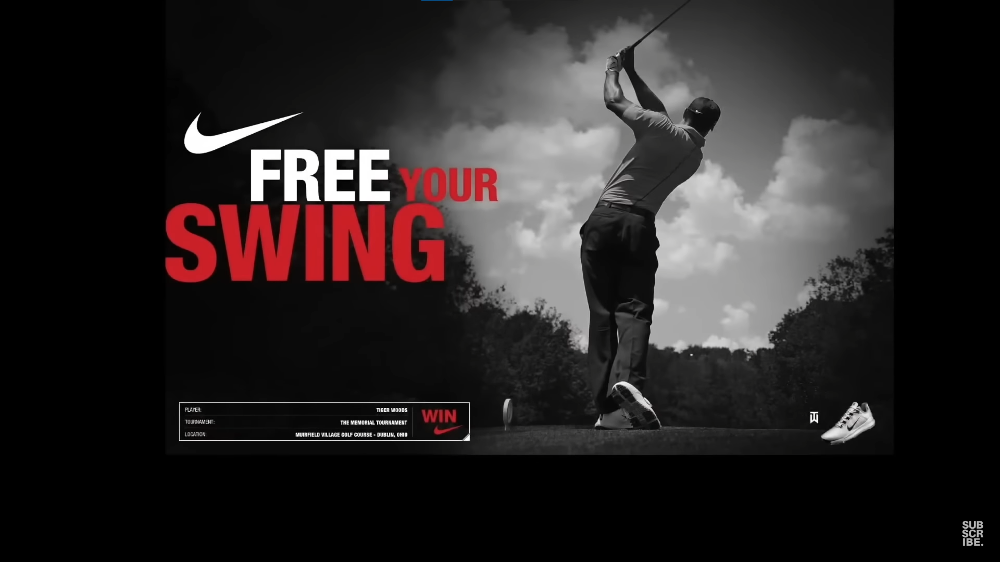
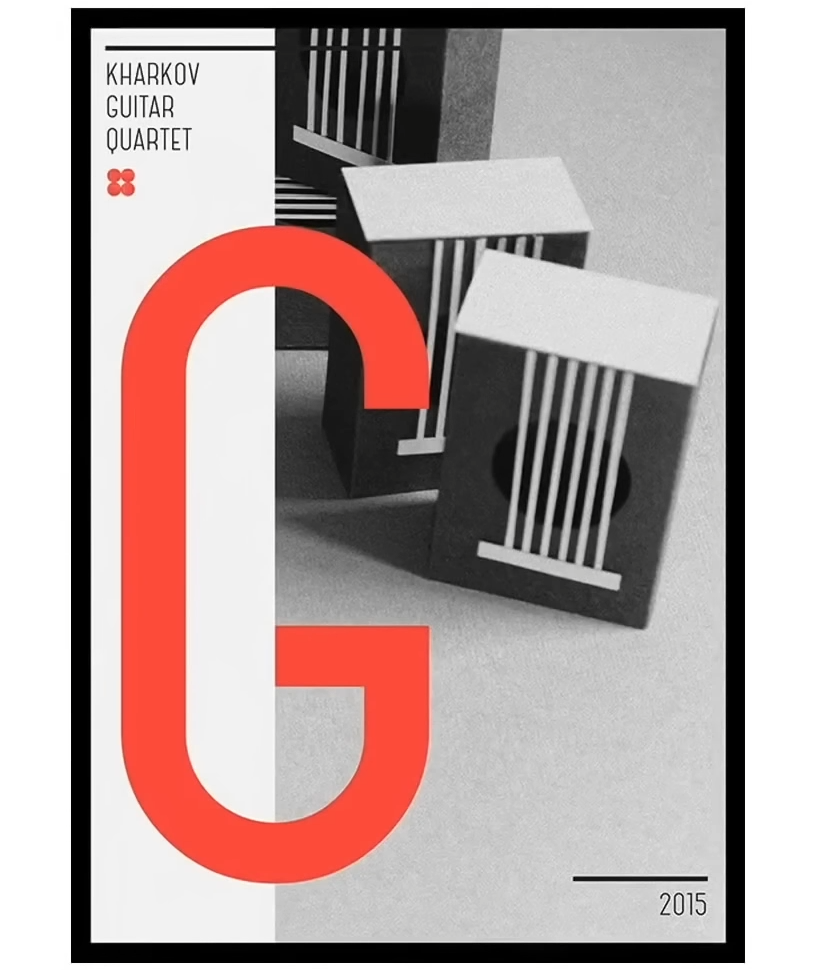
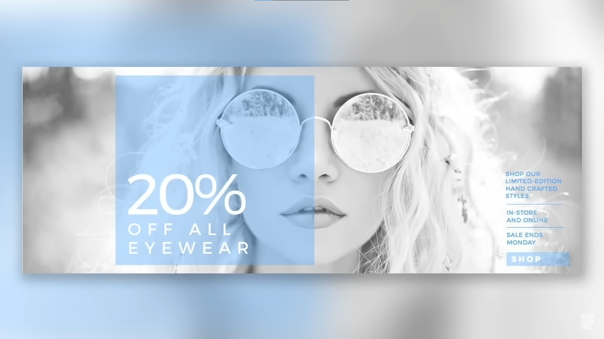
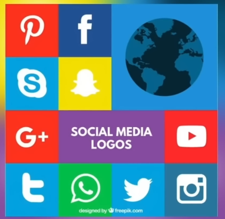
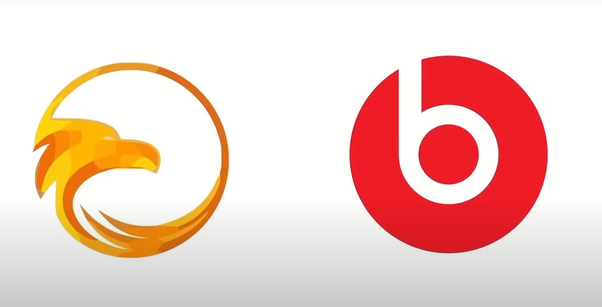
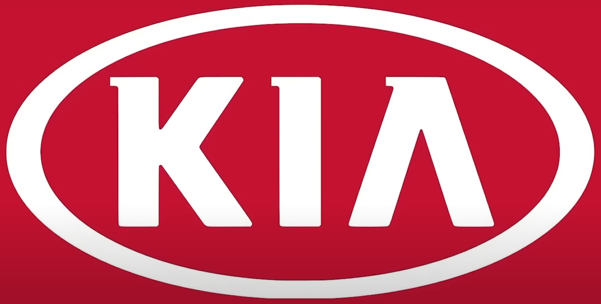
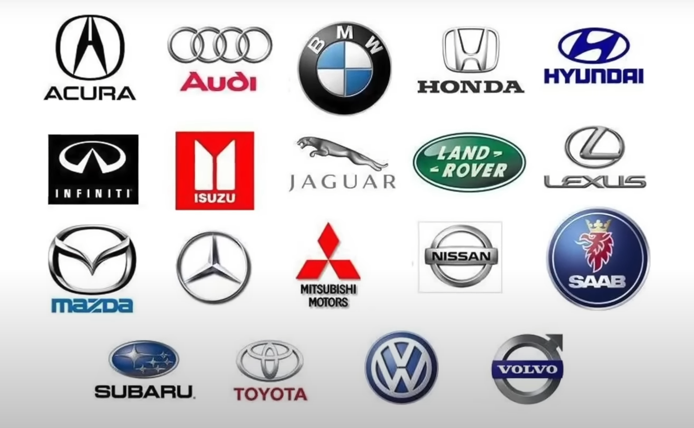
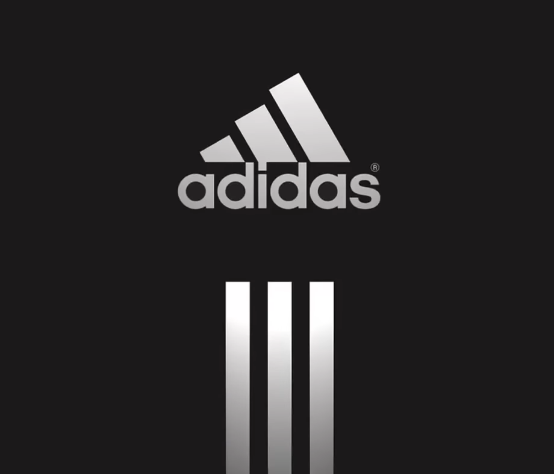
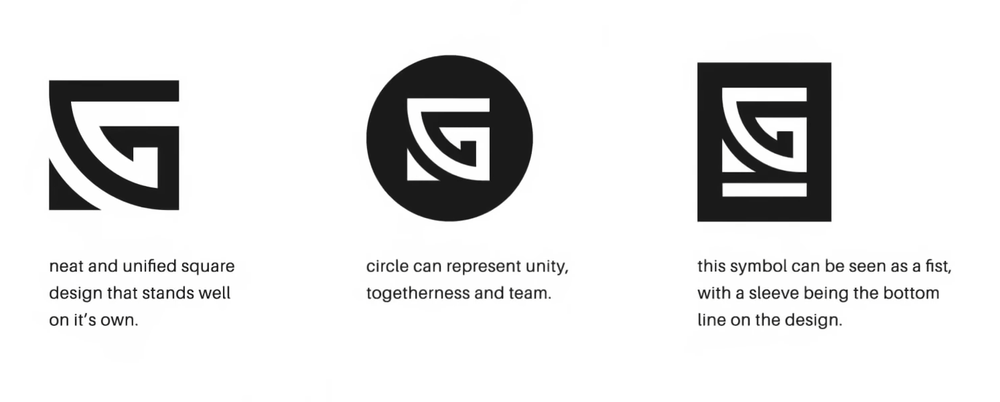

referenced from: https://www.youtube.com/watch?v=-5jSCHZIHlg

# Pychology in graphic design

## 1. Von Restorff Effect / isolation effect

Statement: when multiple objects are shown the one object that differs from the rest is most liekly to be remembered.

ways to do it-> 
1. size
1. shape
1. color
1. layout 

Add a call to action button instead of plain old simple buttons, as it helps to direct attention, 
create interest and steer decisions in a certain direction. eg:

Prime example for call to action is pricing page...

Here they are drawing attention towards the popular price(probably the one which has most profit for the owner) highted in blue and the box is larger making it more sugeestable and appealing...

You have to make the elements in your design look like they belong together and tell a consistent visual story but you also want to Delight the audience for putting in a few surprises and twists and turns. These creative tweaks can actually prevent boredom to the viewerand actually render your designs that much more memorable.

  
Use of same in branding ->

Snapchat: yellow symbolises it standing out fomr the usual trend of blues and reds in branding. 

Downfall and need to be used with caution:
the problem is using the isolation effects you do take the viewers attention span onto one pinpointed are depending on how blatant and how obvious the contrast is this can potentially harm the overall ececution of a design if Vital information is not taken in by the viewer as they will be focused on one area due to the effect.
Humans have a **very short attention span of 8 seconds** on average.

## 2. Shape Psychology
**Circular shape** tend to generate a positive response within the emotional centers of the brain ralating it to community, friendship or love and unity. But they can also convey perfection and are also quite attention seekin in nature.

**Oval Shape** suggests sturdiness, endurance and stability(reason why lot of car companies use this shape in there logos)

 

**Sqaure and rectangles** They create a perception of power and strength.
combined with lines and triangles gives it professionalism, efficiency and stability. All appealing to the left part of the brain. creating a balance of practicality and combined with colors of red or blue they invoke a perception of dynamic modernism.  

